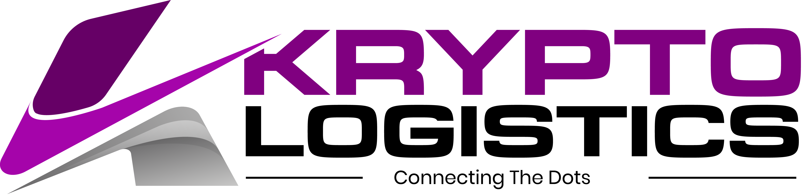

  <h1 align="center">Elly Andrew Ochieng</h1>

 

<table>
<tr>

<td width="60%" valign="top">

<h2>About Me</h2>

My work combines <strong>software engineering, backend development,
database engineering, infrastructure administration and DevOps</strong>
to deliver practical digital solutions from development through production.

I focus on building systems that improve business processes, automate
operations, manage data efficiently and provide reliable user experiences.

My engineering approach emphasizes <strong>clean architecture, security,
scalability, maintainability and reliable deployment</strong>.

</td>

<td width="40%" valign="top">

<h2>Core Competencies</h2>

<table width="100%">
<tr>
<td>Software Engineering</td>
</tr>
<tr>
<td>Full-Stack Development</td>
</tr>
<tr>
<td>Enterprise Systems</td>
</tr>
<tr>
<td>Backend & REST APIs</td>
</tr>
<tr>
<td>Database Engineering</td>
</tr>
<tr>
<td>Linux & Infrastructure</td>
</tr>
<tr>
<td>DevOps & CI/CD</td>
</tr>
<tr>
<td>Application Security</td>
</tr>
<tr>
<td>System Automation</td>
</tr>
</table>

</td>

</tr>
</table>

  

<h2 align="center">Technical Skills</h2>

  Technologies and engineering practices I work with across application
  development, backend systems, databases, infrastructure and DevOps.

 

<table width="100%">
<tr>

<td width="33%" valign="top">

<h3 align="center">Development</h3>

</td>

<td width="33%" valign="top">

<h3 align="center">Data & Backend</h3>

</td>

<td width="33%" valign="top">

<h3 align="center">Infrastructure & DevOps</h3>

</td>

</tr>
</table>

  

<h2 align="center">Selected Projects</h2>

  A selection of digital platforms and enterprise systems I have designed,
  developed and deployed.

 

<table width="100%">
<tr>

<td width="50%" valign="top">

  

<h3>Deskplas</h3>

<strong>School Management Platform</strong>

A comprehensive platform designed to automate academic, financial,
student and administrative operations.

Next.js · TypeScript · Prisma · MySQL

<a href="https://deskplas.uhrtur.co.ke">
  <strong>View Project</strong>
</a>

</td>

<td width="50%" valign="top">

  

<h3>Verdia Capital</h3>

<strong>Asset Exchange</strong>

A modern trading and investment platform designed to provide users with a secure and intuitive environment for
  managing trading activities, monitoring markets, and managing investment portfolios.

Next.js · TypeScript · Prisma · MySQL

<a href="https://verdia.capital/">
  <strong>View Project - On going</strong>
</a>

</td>

</tr>

<tr>

<td width="50%" valign="top">

  

<h3>Kenya Wildlife Service</h3>

<strong>Enterprise Digital Transformation & Operational Systems</strong>

Leading the development and maintenance of enterprise applications
supporting Kenya Wildlife Service digital transformation and operational
efficiency.

Delivering secure, scalable and high-performance systems, including
database optimizations that achieved a <strong>60% reduction in query
times</strong> while improving system reliability and service delivery.

Enterprise Applications · Full-Stack Development · Database Engineering · DevOps · System Administration

<a href="#">
  <strong>View Project →</strong>
</a>

</td>

<td width="50%" valign="top">

  

<h3>Kryptologistics</h3>

<strong>Digital Transport & Logistics Platform</strong>

A digital platform for an oil and gas logistics company, designed to
support transportation operations, logistics management, customer
engagement and operational visibility.

Web Application · Logistics Platform · REST APIs · Database

<a href="https://kryptologistics.org/index.php">
  <strong>View Project →</strong>
</a>

</td>

<td width="50%" valign="top">

  

<h3>Uthabiti Africa</h3>

<strong>Childcare Systems & Social Impact Platform</strong>

A digital platform supporting Uthabiti Africa's work to accelerate
quality, affordable childcare across Africa by strengthening systems,
supporting practitioners and partners, and unlocking livelihoods,
especially for women.

Through the Uthabiti Africa Foundation, the platform also supports
community programmes that help translate policy into meaningful,
lasting social impact.

Web Platform · Social Impact · Childcare Systems · Community Programmes

<a href="https://uthabitiafrica.org">
  <strong>Visit Uthabiti Africa →</strong>
</a>

</td>

</tr>
</table>

  

<h2 align="center">Engineering Focus</h2>

 

<table width="100%">
<tr>

<td width="25%" align="center" valign="top">

<h3>Architecture</h3>

Scalable application architecture, clean design and maintainable systems.

</td>

<td width="25%" align="center" valign="top">

<h3>Security</h3>

Authentication, authorization, secure APIs and application protection.

</td>

<td width="25%" align="center" valign="top">

<h3>Infrastructure</h3>

Linux, Nginx, server administration and production deployments.

</td>

<td width="25%" align="center" valign="top">

<h3>DevOps</h3>

CI/CD, automation, Git workflows and deployment management.

</td>

</tr>
</table>

  

<h2 align="center">Let's Connect</h2>

  
  &nbsp;
  

 

  <strong>Building secure, scalable and practical digital solutions.</strong>

  
    Full-Stack Development &nbsp;·&nbsp;
    DevOps &nbsp;·&nbsp;
    Systems Administration &nbsp;·&nbsp;
    Enterprise Applications
  

