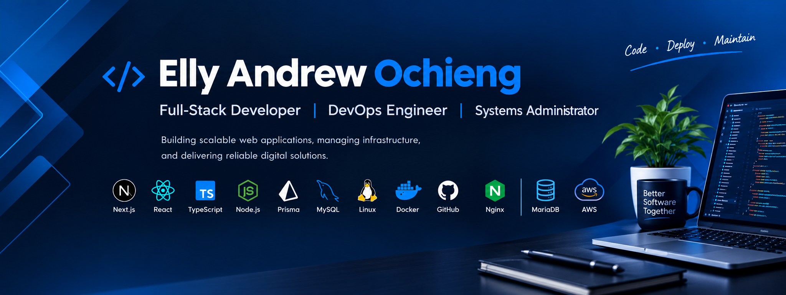

  

 

<h1 align="center">Hi, I'm Elly Andrew Ochieng 👋</h1>

  <strong>Full-Stack Developer &nbsp;|&nbsp; DevOps Engineer &nbsp;|&nbsp; Systems Administrator</strong>

  
  
  

 

<table>
<tr>
<td width="65%" valign="top">

### About Me

I am a software developer with **7+ years of experience** designing, developing, deploying, and maintaining secure, scalable web applications and enterprise systems.

My work combines **software engineering, backend development, database management, infrastructure administration, and DevOps** to deliver practical digital solutions from development through production.

I enjoy building systems that improve business processes, automate operations, manage data efficiently, and provide reliable user experiences.

</td>

<td width="35%" valign="top">

### What I Do

💻 Full-Stack Development

🏗️ Enterprise Systems

🔌 API Development

🗄️ Database Engineering

☁️ Server Administration

🚀 DevOps & CI/CD

🔐 Application Security

⚙️ System Automation

</td>
</tr>
</table>

 

## Technical Skills

<table>
<tr>
<td align="center">
<strong>JavaScript</strong>
</td>
<td align="center">
<strong>TypeScript</strong>
</td>
<td align="center">
<strong>React</strong>
</td>
<td align="center">
<strong>Next.js</strong>
</td>
<td align="center">
<strong>Node.js</strong>
</td>
</tr>

<tr>
<td align="center">
<strong>PHP</strong>
</td>
<td align="center">
<strong>Laravel</strong>
</td>
<td align="center">
<strong>Python</strong>
</td>
<td align="center">
<strong>HTML</strong>
</td>
<td align="center">
<strong>CSS</strong>
</td>
</tr>

<tr>
<td align="center">
<strong>Tailwind CSS</strong>
</td>
<td align="center">
<strong>MySQL</strong>
</td>
<td align="center">
<strong>MariaDB</strong>
</td>
<td align="center">
<strong>PostgreSQL</strong>
</td>
<td align="center">
<strong>Prisma</strong>
</td>
</tr>

<tr>
<td align="center">
<strong>REST APIs</strong>
</td>
<td align="center">
<strong>Linux</strong>
</td>
<td align="center">
<strong>Ubuntu</strong>
</td>
<td align="center">
<strong>Docker</strong>
</td>
<td align="center">
<strong>Nginx</strong>
</td>
</tr>

<tr>
<td align="center">
<strong>Git</strong>
</td>
<td align="center">
<strong>GitHub</strong>
</td>
<td align="center">
<strong>GitHub Actions</strong>
</td>
<td align="center">
<strong>PM2</strong>
</td>
<td align="center">
<strong>CI/CD</strong>
</td>
</tr>

<tr>
<td align="center">
<strong>NextAuth</strong>
</td>
<td align="center">
<strong>Authentication</strong>
</td>
<td align="center">
<strong>API Security</strong>
</td>
<td align="center">
<strong>Database Design</strong>
</td>
<td align="center">
<strong>System Administration</strong>
</td>
</tr>
</table>

 

## Featured Projects

<table>
<tr>

<td width="50%" valign="top">

### Deskplas

A modern school management platform designed to automate academic, financial, student, and administrative operations.

**Stack:** Next.js · TypeScript · Prisma · MySQL

<a href="https://github.com/ellyandrew/deskplas-saas">
  View Project →
</a>

</td>

<td width="50%" valign="top">

### Student Attachment Portal

A digital platform for managing student attachment applications, placement, institutions, departments, stations, and attachment cycles.

**Stack:** Next.js · TypeScript · Prisma · MySQL

<a href="#">
  View Project →
</a>

</td>

</tr>

<tr>

<td width="50%" valign="top">

### Service Request Management

Enterprise workflow platform for managing service requests, users, assignments, processing, and operational reporting.

**Stack:** Next.js · APIs · MySQL · Linux

<a href="#">
  View Project →
</a>

</td>

<td width="50%" valign="top">

### Legal Register

A case management system for managing legal matters, case records, workflows, and organizational legal information.

**Stack:** Web Application · REST APIs · Database

<a href="#">
  View Project →
</a>

</td>

</tr>
</table>

 

## Engineering Focus

<table>
<tr>
<td width="25%" align="center">

### 🧩

**Software Architecture**

Designing maintainable and scalable application architectures.

</td>

<td width="25%" align="center">

### 🔐

**Security**

Authentication, authorization, secure APIs and data protection.

</td>

<td width="25%" align="center">

### ☁️

**Infrastructure**

Linux servers, Nginx, application deployment and production environments.

</td>

<td width="25%" align="center">

### 🚀

**DevOps**

CI/CD, automation, Git workflows and reliable deployments.

</td>
</tr>
</table>

 

## Let's Connect

  
  

  <i>Building secure, scalable and practical digital solutions.</i>

